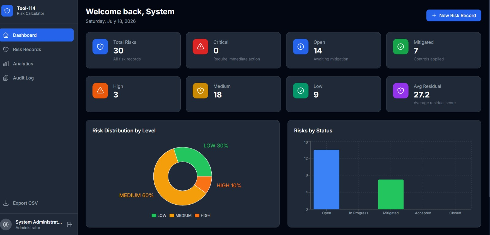

# Tool-114 — Residual Risk Calculator

An enterprise-grade, AI-powered residual risk management platform. Built for security teams, risk analysts, and compliance officers who need more than a spreadsheet.

---

## Screenshots

### Dashboard


### Risk Records


### Create Risk Record


### Analytics


### Audit Log


---

## What is Risk?

**Risk** is the possibility that an event will occur and negatively affect the achievement of objectives. In information security and enterprise risk management, every risk is measured across two dimensions:

- **Likelihood** — how probable is it that this risk event occurs? (1–10)
- **Impact** — how severe would the damage be if it did? (1–10)

### Inherent Risk vs Residual Risk

| Term | Definition |
|---|---|
| **Inherent Risk** | The raw risk before any controls are applied. `Likelihood × Impact` |
| **Control Effectiveness** | How well your existing safeguards reduce the risk (0–100%) |
| **Residual Risk** | The risk that remains *after* controls. `Inherent Risk × (1 - Control Effectiveness%)` |

> Example: A ransomware risk with Likelihood 7, Impact 10, and 25% control effectiveness gives an Inherent Risk of 70 and a Residual Risk of **52.5** — still HIGH. This tool calculates, tracks, and reports that automatically.

---

## Architecture

```
┌─────────────────────────────────────────────────────────┐
│                    Browser :3000                        │
│              React 18 + Tailwind CSS                    │
└──────────────────────┬──────────────────────────────────┘
                       │ HTTP
┌──────────────────────▼──────────────────────────────────┐
│              Backend :8080 (Spring Boot 3.2)            │
│    REST API · JWT Auth · JPA · Redis Cache              │
└────────┬─────────────────────────────┬──────────────────┘
         │ JDBC                        │ HTTP (WebClient)
┌────────▼────────┐          ┌─────────▼────────────────┐
│  PostgreSQL 15  │          │   AI Service :5000        │
│  (Flyway 10)    │          │   Flask + Groq Llama-3    │
└─────────────────┘          └──────────────────────────┘
         │                            │
┌────────▼────────────────────────────▼──────────────────┐
│                     Redis 7                             │
│          JWT Blacklist · Response Cache                 │
└─────────────────────────────────────────────────────────┘
```

---

## Tech Stack

| Layer | Technology |
|---|---|
| Frontend | React 18, Vite, Tailwind CSS, Recharts, React Router v6 |
| Backend | Spring Boot 3.2.5, Java 17, Spring Security, JPA/Hibernate |
| Auth | JWT (jjwt 0.11.5), BCrypt, Redis token blacklisting |
| Database | PostgreSQL 15, Flyway migrations |
| Cache | Redis 7 (Lettuce), Spring Cache |
| AI Service | Python 3, Flask, Groq API (Llama-3.3-70B) |
| API Docs | SpringDoc OpenAPI 2.5 (Swagger UI) |
| Containerisation | Docker, Docker Compose |

---

## Quick Start

### Prerequisites

- [Docker Desktop](https://www.docker.com/products/docker-desktop/) installed and running
- A free [Groq API key](https://console.groq.com) for AI features

### 1. Clone & configure

```bash
git clone <your-repo-url>
cd "RESIDUAL RISK CALCULATOR"
cp .env.example .env
```

Edit `.env` and set your Groq API key:

```env
GROQ_API_KEY=gsk_your_actual_groq_key_here
```

### 2. Start all services

```bash
docker compose up --build
```

First build takes ~3–5 minutes (Maven downloads dependencies). Subsequent starts are fast.

### 3. Open the app

| Service | URL |
|---|---|
| **Frontend** | http://localhost:3000 |
| **Backend API** | http://localhost:8080 |
| **Swagger UI** | http://localhost:8080/swagger-ui.html |
| **AI Service** | http://localhost:5000/health |

---

## Demo Credentials

Two accounts are seeded automatically on first startup:

| Role | Username | Password |
|---|---|---|
| **Admin** | `admin` | `Admin@123456` |
| **Analyst** | `analyst` | `User@123456` |

Admin can create, update, and delete risks. Analyst has read-only access.

The database is pre-loaded with **30 realistic risk records** spanning:
- Cyber threats (ransomware, APT, zero-day, phishing, DDoS)
- Financial risks (fraud, BEC, AML violations)
- Compliance risks (GDPR, data residency, regulatory change)
- Operational risks (insider threat, key person dependency)
- Supply chain risks (vendor failure, third-party breach)

---

## Features

### Risk Management
- Create, read, update, soft-delete risk records
- Automatic residual risk calculation on every save
- Risk level classification: LOW / MEDIUM / HIGH / CRITICAL
- Filter and search by category, status, level, and date range
- Paginated results with sortable columns

### AI Capabilities (powered by Groq Llama-3.3-70B)
- **AI Description** — generates a professional risk description from name + scores
- **AI Recommendations** — returns structured mitigation actions (PREVENTIVE, DETECTIVE, CORRECTIVE, ADMINISTRATIVE, TECHNICAL) with priority levels
- **AI Report** — produces a full risk assessment report with key findings and recommendations
- All AI responses are Redis-cached to avoid redundant API calls

### Security
- Stateless JWT authentication with access + refresh tokens
- Token blacklisting on logout (stored in Redis with matching TTL)
- Role-based access control: `ROLE_ADMIN` and `ROLE_USER`
- BCrypt password hashing (cost factor 12)
- Security headers: CSP, `X-Frame-Options: DENY`, referrer policy
- Full audit log with actor, action, entity, IP address, and timestamp

### Data & Export
- CSV export of all risk records
- PDF/DOCX file attachment support per risk record
- Email alerts when a CRITICAL risk is created
- Scheduled daily digest and deadline reminder emails

### Developer Experience
- Flyway versioned migrations (V1–V4)
- Swagger UI for interactive API testing
- Spring Actuator health endpoint for container health checks
- Redis caching on all read-heavy endpoints
- Jacoco test coverage reporting

---

## Project Structure

```
RESIDUAL RISK CALCULATOR/
├── backend/                    # Spring Boot (Java 17)
│   ├── src/main/java/com/tool114/riskmanager/
│   │   ├── config/             # Redis, OpenAPI config
│   │   ├── controller/         # REST controllers
│   │   ├── dto/                # Request/Response objects
│   │   ├── entity/             # JPA entities
│   │   ├── exception/          # Global exception handling
│   │   ├── repository/         # Spring Data JPA repos
│   │   ├── security/           # JWT filter, SecurityConfig, JwtUtil
│   │   └── service/            # Business logic layer
│   ├── src/main/resources/
│   │   ├── db/migration/       # Flyway SQL migrations (V1–V4)
│   │   └── application.yml     # App configuration
│   └── Dockerfile
│
├── ai-service/                 # Flask (Python)
│   ├── routes/                 # describe, recommend, report, health
│   ├── services/               # ai_service.py, groq_client.py
│   ├── prompts/                # LLM prompt templates
│   └── Dockerfile
│
├── frontend/                   # React 18 + Vite
│   ├── src/
│   └── Dockerfile
│
├── docker-compose.yml
├── .env.example
└── README.md
```

---

## Environment Variables

Copy `.env.example` to `.env` and fill in the values:

```env
# PostgreSQL
POSTGRES_DB=residual_risk_db
POSTGRES_USER=riskadmin
POSTGRES_PASSWORD=YourStrongPassword!

# Redis
REDIS_HOST=redis
REDIS_PORT=6379
REDIS_PASSWORD=YourRedisPassword!

# JWT
JWT_SECRET=your-256-bit-base64-encoded-secret
JWT_EXPIRATION_MS=3600000        # 1 hour
JWT_REFRESH_EXPIRATION_MS=86400000  # 24 hours

# Groq AI
GROQ_API_KEY=gsk_your_key_here

# Email (optional — for alert emails)
MAIL_HOST=smtp.gmail.com
MAIL_PORT=587
MAIL_USERNAME=your@email.com
MAIL_PASSWORD=your-app-password
```

---

## API Reference

Full interactive docs available at **http://localhost:8080/swagger-ui.html** after startup.

### Auth
| Method | Endpoint | Access |
|---|---|---|
| POST | `/auth/register` | Public |
| POST | `/auth/login` | Public |
| POST | `/auth/refresh` | Public |
| POST | `/auth/logout` | Authenticated |

### Risks
| Method | Endpoint | Access |
|---|---|---|
| GET | `/api/risks` | USER, ADMIN |
| GET | `/api/risks/{id}` | USER, ADMIN |
| POST | `/api/risks` | ADMIN only |
| PUT | `/api/risks/{id}` | ADMIN only |
| DELETE | `/api/risks/{id}` | ADMIN only |
| GET | `/api/risks/search` | USER, ADMIN |

### Dashboard & Export
| Method | Endpoint | Access |
|---|---|---|
| GET | `/api/stats` | USER, ADMIN |
| GET | `/export/csv` | USER, ADMIN |
| POST | `/upload` | ADMIN only |
| GET | `/api/audit` | ADMIN only |

---

## Risk Score Reference

| Residual Risk Score | Level |
|---|---|
| 0 – 15 | 🟢 LOW |
| 16 – 30 | 🟡 MEDIUM |
| 31 – 55 | 🟠 HIGH |
| 56 – 100 | 🔴 CRITICAL |

---

## Stopping the App

```bash
# Stop all containers
docker compose down

# Stop and remove all data (full reset)
docker compose down -v
```

---

## License

This project is proprietary software developed by Tool-114. All rights reserved.
